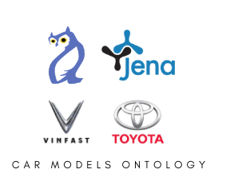

<h1 align="center">CAR MODELS ONTOLOGY (VONT) </h1>
<p align="center">
    <a href="https://jena.apache.org" target="_blank">
        
    </a>
</p>
<p align="center">
  <a href="https://github.com/facebook/react-native/blob/HEAD/LICENSE">
    
  </a>
  <a href="https://reactnative.dev/docs/contributing">
    
  </a>
</p>


## 🤔 Architecture

<p align="center">
    <a href="https://jena.apache.org" target="_blank">
        
    </a>
</p>

## 🤔 Apache Jena?

<p align="left">
    <a href="https://jena.apache.org" target="_blank">
        
    </a>
</p>
Apache Jena (or Jena in short) is a free and open source Java framework for building semantic web and Linked Data
applications. The framework is composed of different APIs interacting together to process RDF data. If you are new here,
you might want to get started by following one of the tutorials. You can also browse the documentation if you are
interested in a particular topic.

https://jena.apache.org

## ⚽ Tutorials

- RDF API tutorial - you will learn the essence of the semantic web and the graph representation behind RDF.
- SPARQL tutorial - will guide you to formulate expressive queries over RDF data.
- Ontology API - illustrates the usage of advanced semantic web features such as reasoning over your data using OWL.
- Finally, some of the tutorials are also available in Traditional Chinese, Portuguese and French.

## 📘 Documentation

- <a href="https://jena.apache.org/documentation/rdf" target="_blank">The RDF API<a/> the core RDF API in Jena
- <a href="https://jena.apache.org/documentation/query" target="_blank">SPARQL<a/> querying and updating RDF models
  using the SPARQL standards
- <a href="https://jena.apache.org/documentation/fuseki2" target="_blank">Fuseki<a/> SPARQL server which can present RDF
  data and answer SPARQL queries over HTTP
- <a href="https://jena.apache.org/documentation/assembler" target="_blank">Assembler<a/> describing recipes for
  constructing Jena models declaratively using RDF
- <a href="https://jena.apache.org/documentation/inference" target="_blank">Inference<a/> using the Jena rules engine
  and other inference algorithms to derive consequences from RDF models
- <a href="https://jena.apache.org/documentation/javadoc" target="_blank">Javadoc<a/> JavaDoc generated from the Jena
  source
- <a href="https://jena.apache.org/documentation/query/text-query.htm" target="_blank">Text Search<a/> enhanced indexes
  using Lucene or Solr for more efficient searching of text literals in Jena models and datasets
- <a href="https://jena.apache.org/documentation/io" target="_blank">I/O <a/> notes on input and output of triples to
  and from Jena models
- <a href="https://jena.apache.org/documentation/notes" target="_blank">How-To’s<a/> various topic-specific how-to
  documents
- <a href="https://jena.apache.org/documentation/ontology" target="_blank">Ontology<a/> support for handling OWL models
  in Jena
- <a href="https://jena.apache.org/documentation/tdb" target="_blank">TDB<a/> a fast persistent triple store that stores
  directly to disk
- <a href="https://jena.apache.org/documentation/tools" target="_blank">Tools<a/> various command-line tools and
  utilities to help developers manage RDF data and other aspects of Jena
- <a href="https://wiki.uib.no/info216/index.php/Java_Examples" target="_blank">Query Examples<a/>

## 🕸️ Scope of this ontology (VONT)

<p align="left">
    <a href="https://jena.apache.org" target="_blank">
        
    </a>
</p>

The Web Ontology Language (OWL) is a family of knowledge representation languages for authoring ontologies. Ontologies
are a formal way to describe taxonomies and classification networks, essentially defining the structure of knowledge for
various domains: the nouns representing classes of objects and the verbs representing relations between the objects.

- This program contains all the vehicles in [Toyota](https://www.toyota.com/all-vehicles) 2022
  and [VINFAST](https://vinfastauto.com) 2022 with details. Web app can query the details using SPARQL-RDF query
  language.

- <a href="src/main/resources/data/owl/vehicle/v3/vinfast.rdf" target="_blank"> RDF file </a>

<p align="center">
    <a href="https://jena.apache.org" target="_blank">
        
    </a>
    <a href="https://jena.apache.org" target="_blank">
        
    </a>
</p>

## ✨ Contributing

Please feel free to contact me or make a pull request.

## ⚙️ Copyright

```
Created by $username on $today
Copyright (c) $today.year . All rights reserved.
Last modified $file.lastModified
```


## 👇 Author

<p>
    <a href="https://nphau.medium.com/" target="_blank">
    
    </a>
</p>